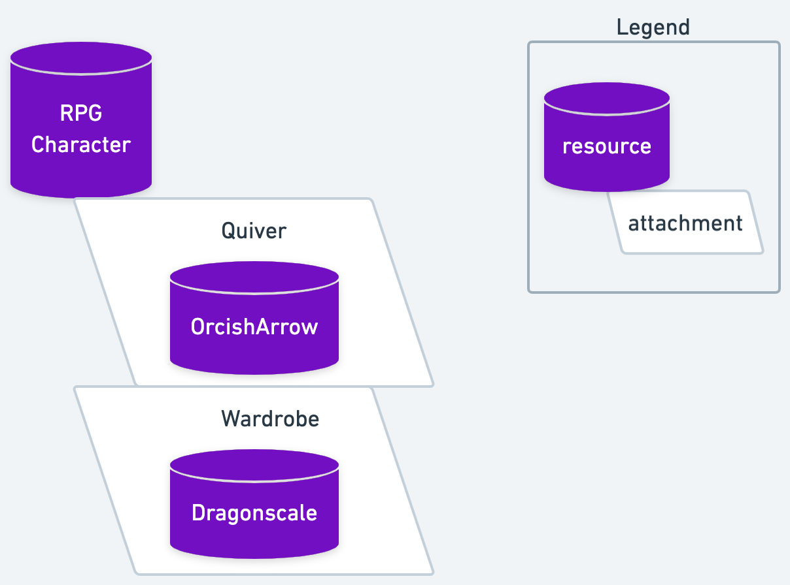

## RPG Character & Item Attachments

This is a repository showcasing Cadence's native attachments by example. Attachments are like "glue" that tie resources together.

You'll learn how NFTs permissionlessly gain utility & functionality with this new language feature.

In the case of this toy repo, how your RPGCharacter NFT can gain the ability to equip different items. We leverage attachments to contain items (arrows & armor) to an NFT (our RPGCharacter NFT). As mentioned earlier, these attachments - designed to be attached to the RPGCharacter NFT - effectively "glue" other resources to the NFT. This way, anywhere the NFT goes, so go the attached items.

Since the attachments contain resources, they retain all of the uniqueness and existence guarantees inherent to resource objects. And access control is still mediated by the contracts that define those resources.